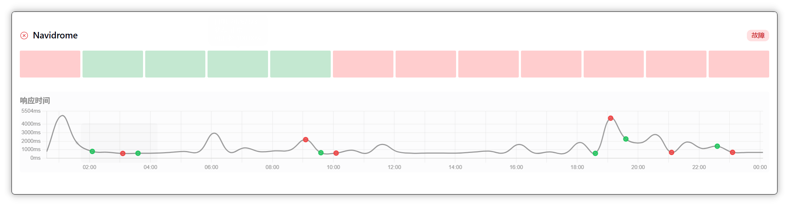
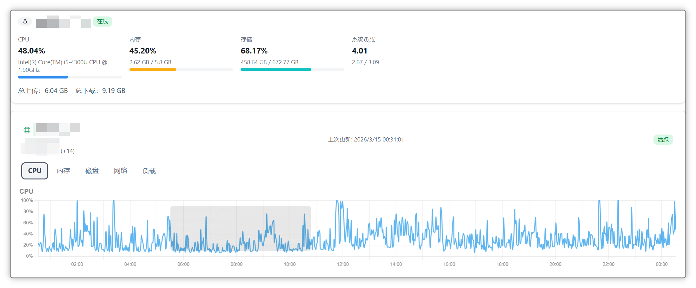

# 起因：NAS折腾用户的监控焦虑





作为一个NAS深度用户，我的“数据中心”是这样的：一台主力NAS跑着各种Docker服务（Navidrome、Openlist、qBittorrent……），另外还有几个小服务直接部署在Cloudflare Workers上（比如一些自用的API、静态站点）。以前监控全靠手动登录NAS看资源占用，或者凭感觉——感觉卡了就去查日志。至于Cloudflare Workers上的服务，就更玄学了，只要不报错就当作一切正常。

这种“佛系监控”迟早要翻车。上个月我发现Navidrome音乐服务总是时而能连上，时而连不上，进NAS一看，CPU早就跑满了，原因是某个容器的日志把磁盘塞爆了。更无语的是，我有个部署在Workers上的定时任务脚本，挂了整整一周我才发现——因为没有监控，它静悄悄地失败，连个通知都没有。

# 痛定思痛，我决定给我的数字资产们配一个“集中监控室”。

要求很明确：

- 能监控NAS的系统指标（CPU、内存、磁盘、网络），也能监控HTTP服务（包括Workers上的API）。
- 颜值在线，最好能有个状态页面分享给偶尔访问我服务的亲友。
- 免费，因为这只是个人爱好，不想为此额外付费。
- 部署简单，毕竟我不是专业运维，太复杂折腾不动。

# 寻寻觅觅，那些不完美的方案

先是在NAS社区逛了一圈，很多人推荐Prometheus + Grafana。我也试着在NAS上跑过，确实强大，但配置太复杂了，光是理解那一堆组件就劝退了。而且它主要是针对服务器内部监控，对Cloudflare Workers这种外部服务基本无能为力。

Uptime Kuma倒是简单，也能监控HTTP，但只能做连通性检测，没法看系统资源。Netdata颜值高、数据细，但它是个单机监控，不能统一展示多台设备。

商业SaaS方案呢？比如UptimeRobot免费版只能监控5个站点，不够用。Datadog免费版有主机数量限制，而且对个人用户来说有点太重了。

正当我准备妥协，自己写个简单脚本+Telegram通知的时候，在GitHub上瞎逛发现了这个项目——XUGOU。

# 偶遇XUGOU：这简直是为我量身定做的

XUGOU是一个基于Cloudflare全家桶的开源监控平台。先看特性：

- 系统监控：有Go编写的Agent，可以装在NAS（或者其他任何Linux设备）上，采集CPU、内存、磁盘、网络数据。
- HTTP监控：支持自定义请求、检查响应状态码/内容，正好可以用来监控我那些Cloudflare Workers。
- 数据可视化：仪表盘图表漂亮，响应式设计，手机也能看。
- 状态页面：可以公开分享，把我监控的服务都列出来，朋友问起来直接甩链接。
- 告警通知：支持邮件、Telegram等渠道（虽然我还没配置，但以后肯定用得上）。
- 用户管理：支持多用户，可以给家人分配只读权限，让他们也看看NAS状态（虽然他们可能并不想看）。

最吸引我的是它的部署方式——完全基于Cloudflare免费套餐。后端跑在Workers上，数据库用D1（Cloudflare的无服务器SQLite），这两个都有慷慨的免费额度。前端可以部署在Cloudflare Pages，也是免费的。整个项目零成本，完美契合我的“白嫖”需求。

而且作者思路和我一样：就是想找个能自己定制、不花钱的轻量监控方案。看到这句“Just a lightweight monitoring solution based on Cloudflare”，我直接决定试试。

# 手把手部署XUGOU

虽然我不是程序员，但跟着文档一步步操作下来，真的不难。我在这里加上一些更详细的步骤，希望能帮你更好地完成部署。让我们开始吧！

## 安装前准备

1. Cloudflare账号（最好有一个托管在CF的域名，白嫖免费域名也可以）。
2. GitHub账号。因为我们要从GitHub部署，而且需要Fork项目仓库。
3. 准备好Cloudflare和GitHub的账号后，我们就能开始部署了。

## 开始部署：一步步操作指南

### 1. 在Cloudflare上创建数据库

- 步骤1: 登陆 Cloudflare控制台。
- 步骤2: 访问左侧菜单栏的“存储和数据库” → “D1 SQL数据库”。
- 步骤3: 在D1数据库管理面板，点击“创建数据库”按钮。
  - 分步骤细化：
    - 给数据库起个名字，比如xugou-d1​，这个名字可以随意，建议用项目域名相关的名字方便记忆。
    - 选择地区时，为了低延迟和稳定性，推荐选择亚太地区（例如新加坡或东京）。
    - 创建完成后，立即在本页面复制数据库的名称和UUID，保存好这些信息，因为我们会用到它们。

### 2. 在GitHub上创建项目仓库，并配置wrangler.toml

Fork项目是部署的关键，你需要复制XUGOU到自己的GitHub账户。

- 步骤1: Fork项目
  - 访问项目主页：[https://github.com/zaunist/xugou](https://github.com/zaunist/xugou)
  - 点击右上角的“Fork”按钮。
  - 确认在自己账户下的XUGOU仓库成功复制。
- 步骤2: 修改wrangler.toml文件
  - 在自己的项目仓库中，找到wrangler.toml​文件。
  - 这个文件里有D1数据库的配置部分，需要你替换占位符。用之前复制的数据库名称和ID来更新内容。
  - 示例代码：

```toml
[[d1_databases]]
binding = "DB"
database_name = "YOUR_DATABASE_NAME"  # 替换YOUR_DATABASE_NAME为你复制的数据库名称
database_id = "YOUR_DATABASE_ID"      # 替换YOUR_DATABASE_ID为你复制的数据库UUID

```
  - 还要注意，wrangler.toml中的第一行name = "xugou-app"​也需要检查，如果要用自定义名字（比如“xugou-status”），提前修改这里。后续在Cloudflare上部署Worker时名称保持一致。
  - 记得提交代码到GitHub仓库，这样Cloudflare才能拉取最新配置。如果要减少触发频率，可以将这个触发器从每分钟改成半小时一次，即把这一行：

```toml
[triggers]
crons = ["* * * * *"]  # 原来是每分钟执行

```
改为：
```toml
[triggers]
crons = ["0,30 * * * *"] # 将为每小时的0分和30分执行，测试成功后建议改成这个频率

```

### 3. 在Cloudflare上部署应用

现在要用Cloudflare的控制台完成部署。

- 步骤1: 登入Cloudflare控制台。
- 步骤2: 访问左侧菜单栏的“Compute → Workers 和 Pages” → 点击“创建应用程序”。
- 首先选择“从GitHub”继续：
  - 按照引导选择你刚刚Fork的仓库。
  - 在项目名称处，填入你修改的自定义名字（如果有的话），默认应使用“xugou-app”或你设定的名字。
- 高级设置：
  - 展开“API令牌”部分，选择“创建新令牌”。
  - 给令牌取个名字，比如“xugou-build-token”。
  - 其余参数保持默认，Cloudflare会自动读取你的wrangler.toml​，并部署Worker。
- 域和官网设置：
  - 部署成功后，进入本Worker项目的“设置”页面。
  - 在“域和路由”标签下，添加一个自定义域名（比如“[xugou.yourcfdomain.com](http://xugou.yourcfdomain.com)”），这样部署后你就能用这个域名访问监控网页。

### 4. 完成部署并优化

- 完成：稍等一两分钟后，通过自定义域名访问即可看到前端界面——登录时，默认用户名是admin，默认密码是admin123，登录后可以修改这些设置。
- 使用：登陆后，可以在管理页面添加自己的监控API或者客户端，注意，客户端需根据安装脚本自行在你的设备上安装。

- 最后：测试监控稳定后，记得修改wranglers.toml中的crons部分，间隔不要太短。默认是为了方便测试，建议修改为半小时运行一次。
- 站点升级：后续可以同步拉取作者的代码更新，或者自行修改仓库代码，每次修改并提交代码后，Cloudflare会自动触发重部署Worker。

# 测试：数据跳出来的那一刻，值了

登录前端页面，默认用户名密码是admin/admin123（进去可以改）。仪表盘还是空的，但等我启动Agent后，刷新页面——CPU曲线、内存占用、磁盘容量……全都出来了！看着那些实时刷新的图表，心里那个舒坦。

接着测试HTTP监控。我添加了几个部署在Workers上的API地址，设置好请求头和预期状态码（比如200）。XUGOU会定期去请求这些地址，把响应时间、状态码记录下来。以后某个Worker出问题，仪表盘上立刻能看出来。

顺便试了试状态页面功能。在后台勾选几个监控项，开启状态页面，就能得到一个公开链接。点进去一看，所有服务状态一目了然，绿色表示正常，红色表示异常，简洁大方。我马上把链接收藏了，以后朋友问“你的某某服务还能用吗”，直接甩链接，省事。

# 写在最后：NAS玩家的监控自由

现在，我的监控室终于建成了。NAS的系统负载、Workers上的API健康，都在同一个地方展示。再也不用担心某个服务默默挂掉无人知，也不用为了看个CPU占用而SSH登录半天。

最让我开心的是，这整套系统没花我一分钱，还完全由我掌控——数据存在自己的Cloudflare账号里，Agent是开源的，想改哪里改哪里。对于一个爱折腾的NAS用户来说，这种“掌控感”大概就是最大的快乐吧。

如果你也和我一样，有NAS、有Cloudflare服务，或者单纯想找个轻量免费的监控方案，不妨试试XUGOU。部署真的很简单，文档也很清晰。万一遇到问题，提个Issue，作者回复也挺快（毕竟同是天涯沦落人）。

最后，感谢作者的开源精神，让我这种非专业人士也能拥有专业级的监控体验。折腾无止境，希望我的经验能帮到同样在路上的你。

---

项目传送门：[zaunist/xugou](https://github.com/zaunist/xugou)  
在线体验：[https://xugou.mdzz.uk/dashboard](https://xugou.mdzz.uk/dashboard)  
状态页示例：[https://xugou.mdzz.uk/status](https://xugou.mdzz.uk/status)

#
